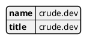
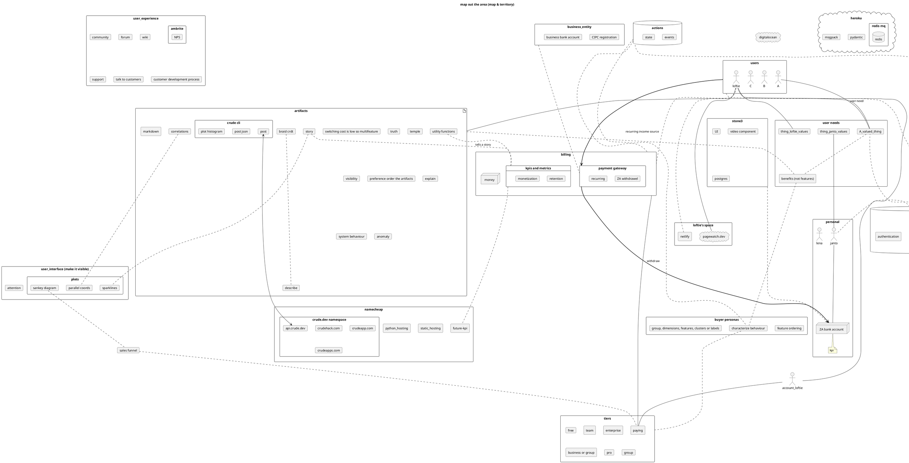

# artifact

truthfully describe

* target
* constraint

* ecosystem

* authentic experience

* make visible

* order environment for target persistance


## target

create profitable software system

describe state preferences
* high value in bank account
* software assets
* quantify in kpis


### 1. target: profitable

```plantuml
rectangle paddle
rectangle account
paddle -> account
```

obtain [payments]() to bank account within timespan

```math
V_{T,N} = \Big\{ \sum_{t \in T, n \in N} r_n \Big\}_{\textbf{actions,choices}}
```

```math
T = \{2021..2025\}
```

### 2. target: internal

something I want to create
* autoencoder regimes

### 3. target: utility

user's preferred service
show benefits to user
address need / product necessity

describe needs and desires of user and self

describe user behaviour


---

## ecosystem

describe
* 

---

### constraint

### constraint: attention

focus, sacrifice
focus is directing attention
sacrifice one area for another

when I build crude systems I make trade-offs
how do we decide what can be sacrificed?
* prioritize and cut off

relevance: precision recall

* F-score

```math
F_\beta = \frac{(1 + \beta^2) \cdot (\mathrm{precision} \cdot \mathrm{recall})}{(\beta^2 \cdot \mathrm{precision} + \mathrm{recall})}
```

`F_{\beta }` measures the effectiveness of retrieval with respect to a user who attaches β times as much importance to recall as precision

```math
\text{C}_\beta = \log_2 {F_\beta}
```

Two other commonly used F measures are the {\displaystyle F*{2}}F*{2} measure, which weights recall twice as much as precision, and the {\displaystyle F*{0.5}}F*{0.5} measure, which weights precision twice as much as recall.
information needs, explore vs exploit: β

```math
\sim_u
```

* [Relevance](<https://en.wikipedia.org/wiki/Relevance_(information_retrieval)>) relevance denotes how well a retrieved document or set of documents meets the information need of the user.
* is the concept of one topic being connected to another topic in a way that makes it useful to consider the second topic when considering the first.

[Cohesion](<https://en.wikipedia.org/wiki/Cohesion_(computer_science)>)

* Functional cohesion (best) is when parts of a module are grouped because they all contribute to a single well-defined task of the module

[Coupling](<https://en.wikipedia.org/wiki/Coupling_(computer_programming)>)

* the degree of interdependence between software modules; a measure of how closely connected two routines or modules are;[1] the strength of the relationships between modules.
* Low coupling often correlates with high cohesion, and vice versa. Low coupling is often seen as a sign of a well-structured computer system and a good design, and when combined with high cohesion, supports the general goals of high readability and maintainability

reliable

incomplete in some sense
  visual messiness
    dont fake it as an aesthetic
  doing one thing well

do not navigate (and abandon) the user into a dead end

### constraint: time

* plan
* discipline, routine

### constraint

constraint = sum(price_per_unit * unit_type for each unit_type)

---

## progress

making progress if
* work done towards a target
* work done increases probability of reaching a target
  * improved description of target
    * more precise description
    * discovery of higher value in area of target
  * 
* work done reduces risk of missing target
  * identification of risks

---

## counter

perfectionism + completeness


to what end


### components

---

funders want growth and retention

policy to maximize targets

```math
\max E[R_T] = \max \sum_t \sum_{\text{tiers}} p(r_t) * r_{\text{tier}} \\
{\displaystyle \pi :A\times S\rightarrow [0,1]} \\
{\displaystyle \pi (a,s)=\Pr(a_{t}=a\mid s_{t}=s)} \\
{\displaystyle R=\sum _{t=0}^{\infty }\gamma ^{t}r_{t},} \\
{\displaystyle V_{\pi }(s)=\operatorname {E} [R]=\operatorname {E} \left[\sum _{t=0}^{\infty }\gamma ^{t}r_{t}\mid s_{0}=s\right],} \\
{\displaystyle V^{\pi }(s)=E[R\mid s,\pi ],} \\
{\displaystyle V^{*}(s)=\max _{\pi }V^{\pi }(s).} \\
\text{or}\\
{\displaystyle Q^{\pi }(s,a)=\operatorname {E} [R\mid s,a,\pi ],\,} \\
{\displaystyle Q(s,a)=\sum _{i=1}^{d}\theta _{i}\phi _{i}(s,a).}
```

forecast income from tiers


useful to determine relevant events

```math
P(\text{user \{registers, subscribes, unsubscribes\} by time } t | \mathbf{x}_{u,<t})
```

given a user's behaviour at `t=0`,

fit / plot

* log-normal(durations)
* Poisson distribution
* Weibull

```python {cmd=true matplotlib=true}
import matplotlib.pyplot as plt
import seaborn

# df.plot()

plt.plot([1,2,3, 4])
plt.show() # show figure
```

---

## crude.dev

adjective

1. in a natural or raw state; not yet processed or refined.
2. constructed in a rudimentary or makeshift way.
3. lacking grace, socially unrefined.

the incompleteness and inconsistency of software

> code will end up as an incomplete implementation of an idealized solution to a poorly understood need. this crudeness cannot in principle be overcome due to uncertainty and real world constraints on the developer

mitigations

* re-prioritization and focus

the first cuts are prioritized constraints. they will be crude but form initial technical constraints around which the following technical decisions are made.
prioritization in crudeness. sacrifices something

principles to test / falsify / disprove / invalidate
* push work to the db
* prefer batching apis to single resource requests
  * might be simpler to do single, but requires redoing a lot when expanding
  * js libraries client side
  * URIs (Uniform Resource Identifier) typically represent a single resource
* maybe rather just do graphql

crude + flexibility
* specify constraints
* minimal changes at other places

describe data (data driven)
* not messages or objects for comms
* but representative of domain primitives
* data at rest description?

not brittle

opposite of crude


building high vs wide

naming things

from the concrete to the abstract
from the result backwards to the actions/priorities?

why can't I write all the code I need to make money in a week?

the 5 lines
  contains unique business value

minimize interfaces

---

### aesthetics
- for users and payment gateway
* space oddesy / nasa / 3d printed
* commitment to truth
- line drawings / sketch / elegant prototype

fabric

/images

---

```python {cmd hide}
print("")
```

```bash {cmd}
echo 'a -> b' | java -jar ~/Documents/plantuml.jar -tsvg -pipe
```

#### auth

<!-- [[[cog
run(defence('''
-->

```prolog
a :- 5
```

<!-- '''))
]]] -->
<!-- [[[end]]] -->

#### site props

<!-- [[[cog
run(defence('''
-->

```python {hide}
main_site = dict(
  name = "crude.dev",
  title = "crude.dev",
)
with remind(), Fence("plantuml"):
  cog.outl("@startjson")
  cog.outl(json.dumps(main_site, indent=2))
  cog.outl("@endjson")
```

<!-- '''))
]]] -->
<!-- generated output below -->

<!-- generated output above -->
<!-- [[[end]]] -->



## prioritization of needs and wants

attention

* preference ordering

https://en.wikipedia.org/wiki/Kendall_rank_correlation_coefficient

crude

* incomplete

---

all code is a crude approximation of an ideal solution to a vaguely understood problem/need
incomplete
tied to the external world which shifts
applies order to information. cuts up the world

truthfully describe the solution and world so the two merge into one
features that appear are properties inherent to the need/problem and not of the implementation

bruce lee

### what am I chasing?

specify target, system does rest
spend my attention on higher level problems
let the irrelevant details sort itself out
easily switch between specific solutions by only changing a few lines
focus and specialize on the right thing
details are ok there

job "replacement"


bottom up
you cant do only architecture

my attention

> 1. _individuals over processes and tools_

attention economy
environment + attention -> processes rule us

reduce code

bring some authenticity and honesty to dev
cargo cult under the guise of best practices
wasting my time building dumb ways
individual vs group

constraints on human attention

target specify

focus = sacrifice, saying no to something

focus engineering attention on the unique components

easy for me to get absorbed and go narrow

orderliness

* boundaries
* categories

visibility
code like it wont be revisited
throwing away code is fine

I experience as soul crushing

language cannot accurately describe the patterns, algorithms and structure underlying systems

design patterns is an attempt

declarative

procedural

consider the space of all possible programs / codespace

forces that shape and place constraints on code

* experiences and behaviour of individual coders
    * individual
    * groups and authenticity
* time constraints on code generation. all solutions are partial
    * there is never enough time
    * limited attention
* interfaces to other systems
* behaviour/structure of organisation and structure of cooperation

hard constraints

* organisational

[optimization](https://en.wikipedia.org/wiki/Constrained_optimization) towards certain utility function

* value
* affordance of abilities to user

probabilistic graphical model

minimize work you have to do tomorrow

* create less code to maintain
* simplify things

if your software has an differentiating edge it is likely in the complexity others can't do

* wrapping a hack

why do interfaces exist?

* impedance mismatch between syntax/semantics
* separation of concern

code the constraints first

* end user experience
* technical reaching
* of ideal

### needs and wants

the bumps, constraints and restrictions you experience are what prevents potential competitors and
and some of the problems customers would want solved
in fact you may be able to turn a competitor into a user if the barrier is too high for them

## timespan

```latex
E[f(t)] t = 0..T
```

good enough for now vs reliable enough for later ()

### using SaaS

heroku

how high can you stack (required) features until it collapses under its own weight

sharpen focus. you have 0 time. you are already sacrificing one thing for another you just aren't realizing it. tick tock


outsource

* auth / user management
* payments

### ipc

### security

https

#### headers

request

```
Authorization
Accept-Encoding
Range
```

response

```
X-Frame-Options: SAMEORIGIN
Content-Encoding: gzip
Accept-Ranges
```

MUST NOT -> CANT

https://developer.mozilla.org/en-US/docs/Web/HTTP/Headers/Strict-Transport-Security

https://developer.mozilla.org/en-US/docs/Web/HTTP/Network_Error_Logging
internal server if external failed

https://developer.mozilla.org/en-US/docs/Web/HTTP/Headers/Retry-After
scheduled downtime

https://developer.mozilla.org/en-US/docs/Web/HTTP/Headers/Server-Timing
important for visibility
https://developer.mozilla.org/en-US/docs/Web/API/PerformanceServerTiming

```
let entries = performance.getEntriesByType('resource');
console.log(entries[0].serverTiming);
```

### web

stack is high and wonky

client-server interface

* why

code as configuration

performance

1. my attention is limited
2. lucid is good for everyone
3. code artifacts manifested towards current envisioned solution
4. attention is drawn by ideal future self of individual and obstacles in way
5. value hierarchy (value is not consciously created)

6. it's important how you cut up the world into categories and/or label items

encounter the unknown is a subconscious reaction

what persists?

biological envision a future

fragmentary personalities

necessities for persistence

* exists in code form

sufficiency for persistence

* too complex to remove. bound to rest of system
* user relies on and have become entrenched in eccentricity. dependent on how humans and organisation can change

reflects environment structure. boundaries. subconscious.

## the waste of out-of-band solutions

not convincing after explained to loftie

making solutions to technical problems obvious

* increase visibility
* decrease effort to get to information
* these diagnostic tools will form part of the solution

in-band tools

* refactoring solutions into codebase
* out of band solutions like telemetry is a dead end and it would be more useful long term if important data could be integrated back into the system
* what does mean for crude.dev? important to enable client to integrate data and code back into their system. important to growth of their solution from technical and business perspective

## architecture and design

> _There is another style of definition of architecture which is something like “architecture is the set of design decisions that
> must be made early in a project.” I complain about that one, too, saying that architecture is the decisions that you wish
> you could get right early in a project, but
> that you are not necessarily more likely to
> get them right than any other._
>
> * [Martin Fowler](https://martinfowler.com/ieeeSoftware/whoNeedsArchitect.pdf)

https://martinfowler.com/articles/designDead.html

https://en.wikipedia.org/wiki/File:National_Theatre_-_detail_of_shuttered_concrete.jpg)

https://en.wikipedia.org/wiki/Truth_to_materials
https://en.wikipedia.org/wiki/Form_follows_function

https://en.wikipedia.org/wiki/File:Paradise_Place_Raw_Concrete.jpg)

https://en.wikipedia.org/wiki/Bauhaus
ideology
https://en.wikipedia.org/wiki/Suprematism
https://en.wikipedia.org/wiki/File:Kazimir_Malevich,_1915,_Black_Suprematic_Square,_oil_on_linen_canvas,_79.5_x_79.5_cm,_Tretyakov_Gallery,_Moscow.jpg)

color
https://en.wikipedia.org/wiki/File:Georg_Christoph_Lichtenberg._G%C3%B6ttingen,_1775,_plate_III.jpg)
https://en.wikipedia.org/wiki/Watercolor_painting


https://en.wikipedia.org/wiki/Design_science_(methodology)

https://github.com/airbnb/visx/

> One way to really dig into a character is to ask yourself "What does my character _want_?", "What do they _need_?", "How are those two things different?", and "Why can't they have either one?". \[...\] If your story is turning around this character's needs and wants, then you will naturally be including the character in a lot of the story decisions.
> One way you can go wrong with a book is by making the character not want or need anything, and a lot of times what will happen is, that character becomes an external observer of some really interesting story happening with some other character.
> 
> [Brandon Sanderson](https://en.wikipedia.org/wiki/Brandon_Sanderson), Science fiction, fantasy author, [^](https://www.youtube.com/watch?v=mMeNnX1FGgg)

patterns that are scale invariant?
try fail cycle in stories towards goal
Yes, but
No, and
end with try succeed cycles
Yes, and
No, but

## on what to value

> REMNICK: _In a wonderful profile by Ian Parker in our magazine we were lucky to do, you described something extraordinary.
> We live in two worlds at once, even in — even in the city. We live in the natural world, trees, grass, dirt.
> IVE: Yes.
> REMNICK: And we live in the manufactured world.
> And when you walk around the manufactured world, too much of it — so much of it testifies to carelessness in — in — in human activity, in engineering, in ascetics.
> What do you mean by that? What is carelessness and what — how does it offend you and maybe push you toward creative work?
> IVE: Well I think that this — this — this stems from a realization. And I think, I mean, this is — I think this is a big deal that every single object that is made testifies to the values and the preoccupations of the people that got together to make it.
> And I guess it’s — it’s a, sort of, an occupational hazard of mine, but I find it very hard not to see what — what’s behind the object. Because the object really is the culmination of multiple decisions. It’s — it’s a comment on, sort of, an individual’s, sort of, sets of values; a collection of people, how they work and what they believe in.
> But everything made testifies to a — a criteria and set of values._ > [Johny Ive](https://en.wikipedia.org/wiki/Jony_Ive) > https://9to5mac.com/2017/10/06/jony-ive-new-yorker-techfest-live/

* what do I enjoy?
* what do I spend my time on?
* [personality]

## practicality

> *As engineers, we don't get paid to do things right, we get paid to do things just right enough.*
> -- Adam Steltzner, Jet Propulsion Laboratory

## language

describe the problem space

* truthful
* lucid

## on methodology

> _The allure and seduction of best-practice thinking poisons genuine dialogue about both what we know and the limitations of what we know. [...] That modeling of and nurturing deliberative, inclusive, and, yes, humble dialogue may make a greater contribution to societal welfare than the search for generalizable, "best-practice" findings – conclusions that risk becoming the latest rigid orthodoxies even as they are becoming outdated anyway._
>
> — Michael Quinn Patton

rationalizing cargo-cult solutions


> I like to find (a) simple solutions (b) to overlooked problems (c) that actually need to be solved, and (d) deliver them as informally as possible, (e) starting with a very crude version 1, then (f) iterating rapidly. 
> — Paul Graham


## on simplicity

> _Simplicity is a prerequisite for reliability._
>
> — Edsger W. Dijkstra

> _For every problem there is a solution which is simple, clean and wrong._
>
> — H. L. Mencken

> _Vigorous writing is concise. A sentence should contain no unnecessary words, a paragraph no unnecessary sentences, for the same reason that a drawing should have no unnecessary lines and a machine no unnecessary parts. This requires not that the writer make all his sentences short, or that he avoid all detail and treat his subjects only in outline, but that every word tell._
>
> —  William Strunk Jr., "Elementary Principles of Composition", The Elements of Style

> “The guiding motto in the life of every natural philosopher should be, Seek simplicity and distrust it.”
> — Alfred North Whitehead, The Concept of Nature (1920) ch. 7


> “Civilization advances by extending the number of important operations which we can perform without thinking of them. ”
> ― Alfred North Whitehead

> “The obvious is that which is never seen until someone expresses it simply.”
> — Kahlil Gibran

“The Poems, all three hundred of them, may be summed up in one of their phrases: ‘Let our thoughts be correct.'”

– Confucius

“The trouble with simple living is that, though it can be joyful, rich, and creative, it isn’t simple.”

— Doris Janzen Longacre

> * _Law 1: The simplest way to achieve simplicity is through thoughtful reduction._
> * \[...\]
> * _Law 10: Simplicity is about subtracting the obvious, and adding the meaningful._
>
> — John Maeda, [lawsofsimplicity.com](http://lawsofsimplicity.com/)

> The Zen of Python
>
> * Beautiful is better than ugly.
> * Explicit is better than implicit.
>     Simple is better than complex.
>     Complex is better than complicated.
>     Flat is better than nested.
>     Sparse is better than dense.
>     Readability counts.
>     Special cases aren't special enough to break the rules.
>     Although practicality beats purity.
>     Errors should never pass silently.
>     Unless explicitly silenced.
>     In the face of ambiguity, refuse the temptation to guess.
>     There should be one-- and preferably only one --obvious way to do it.
>     Although that way may not be obvious at first unless you're Dutch.
>     Now is better than never.
>     Although never is often better than _right_ now.
>     If the implementation is hard to explain, it's a bad idea.
>     If the implementation is easy to explain, it may be a good idea.
>     Namespaces are one honking great idea -- let's do more of those!
>
> — Tim Peters, [PEP 20](https://www.python.org/dev/peps/pep-0020/)

“To simplify complications is the first essential of success.”

— George Earle Buckle

"It is not a daily increase, but a daily decrease. Hack away at the inessentials." - Bruce Lee

"Understanding reduces the greatest to simplicity, and lack of it causes the least to take on the magnitude." - Raymond Holliwell

"If more than one theory is consistent with the observations, keep all theories"
- Epicurus


#### MVP or SLC
https://blog.asmartbear.com/slc.html
Simple, Lovable and Complete
customers hate MVPs


"**Y**ou **A**in't **G**onna **N**eed **I**t"


## characteristics of

behaviour

## true statements

principles is what you need when you lack experience

* true optimal form is revealed as it is used
* code is a risk
* refinement carries risk
* consistent vs complete

* trust
* stability = less attention needed down the line

* mockup
* proof of concept
* primer
* prototype

* cut once

* philosophical process of accurately naming and describing
* represented in all modals

    * lucid
    * nouns, verbs and
    * visual form

* business value

* business software is about building these models
* domain knowledge
* software requires formalization

* technical debt
* bitrot

* visibility of issues

* minimize the number of interfaces
* leverage existing metaphors
* I do not use Object Type or Property. those are low level words reserved for the language.
* id, item, name, key, value

* I have a tendency to want to generalize
* keep it under control by being clear

## the wrong kind of crude

permanent temporary solution
entrenched
permanent stopgap
is that so wrong?

Rube Goldberg machine

> Because Rube Goldberg machines are contraptions derived from tinkering with the tools close to hand, parallels have been drawn with evolutionary processes
>
> -- [wikipedia](https://en.wikipedia.org/wiki/Rube_Goldberg_machine)

## automation

tools

* black

## style

indicates readyness

color selection

black + gray
colorweheel

# about

* Dr Janto Dreijer enjoys building software
* Engineer, compsci
* contracting

# topics

[/topics](/topics)

# tools

[figma](https://www.figma.com/)

https://figma-to-react.vercel.app/

[framer](https://www.framer.com/)
Framer is an all-in-one tool that helps teams design every part of the product experience. Start in Framer and get to a functional prototype faster than ever—no code required.

[builder.io](https://www.builder.io/)

https://insights.hotjar.com/sites/2324843/surveys/list

https://segment.com/
software and APIs to collect, clean, and control their customer data.

https://matomo.org/
Google Analytics alternative that protects your data and your customers' privacy

https://github.com/graphql-python/graphene
Graphene is an opinionated Python library for building GraphQL schemas/types fast and easily.

https://github.com/facebook/relay
Relay is a JavaScript framework for building data-driven React applications

https://tartiflette.io/
GraphQL Server implementation built with Python 3.6+

## no-code


## SaaS

many things that could be outsourced to other companies
* which parts
* architecture will place constraints
* adaptor / interface code will be written
* lots of nuanced docs will need reading
* rather focus on business objects?


###

## what is a constraint?

to be a viable solution code needs to conform to constraints
* domain constraints
  * inherent complexity
* business constraints
* conform to interfaces
  * APIs
    * external
      * REST api
      * db schema
      * file format
    * internal
      * self imposed by previous decisions
      * corresponds to accidental complexity
  * interfaces themselves are constrained interactions

### domain mismatch
** a domain is fully described by the shared goals, tools and obstacles of the individuals and systems**
**when imposed constraints do not enable the goals, they are obstacles, and the value of the system to these users is reduced**

**even without direct interaction, constraints function as a boundary value which has influence on actions and concepts within the domain**

* integration bugs
* domain mismatch
  * strain between components on environment to conform to solution's shape


type systems are constraints on variables
validation checks are constraints


data encoding
* rest, yaml, dictionary/list
programming language re-encoding
CSS/JS differences


### title

```pre
                          .___               .___             
  ____ _______  __ __   __| _/ ____        __| _/ ____ ___  __
_/ ___\\_  __ \|  |  \ / __ |_/ __ \      / __ |_/ __ \\  \/ /
\  \___ |  | \/|  |  // /_/ |\  ___/     / /_/ |\  ___/ \   / 
 \___  >|__|   |____/ \____ | \___  > /\ \____ | \___  > \_/  
     \/                    \/     \/  \/      \/     \/       

                       .___              .___           
  ___________ __ __  __| _/____        __| _/_______  __
_/ ___\_  __ \  |  \/ __ |/ __ \      / __ |/ __ \  \/ /
\  \___|  | \/  |  / /_/ \  ___/     / /_/ \  ___/\   / 
 \___  >__|  |____/\____ |\___  > /\ \____ |\___  >\_/  
     \/                 \/    \/  \/      \/    \/      

Font: big
                        _              _              
                       | |            | |             
  ___  _ __  _   _   __| |  ___     __| |  ___ __   __
 / __|| '__|| | | | / _` | / _ \   / _` | / _ \\ \ / /
| (__ | |   | |_| || (_| ||  __/ _| (_| ||  __/ \ V / 
 \___||_|    \__,_| \__,_| \___|(_)\__,_| \___|  \_/  
                                                      
                                                      
                     _           _            
  ___ _ __ _   _  __| | ___   __| | _____   __
 / __| '__| | | |/ _` |/ _ \ / _` |/ _ \ \ / /
| (__| |  | |_| | (_| |  __/| (_| |  __/\ V / 
 \___|_|   \__,_|\__,_|\___(_)__,_|\___| \_/  
                                              
                   |             |          
 ___  ___       ___| ___      ___| ___      
|    |   )|   )|   )|___)    |   )|___) \  )
|__  |    |__/ |__/ |__      |__/ |__    \/ 
                         -                  


```


state values
* clearly describe what is true
  * readability counts
* generalize from specific practical examples
* common idioms should be enabled by the syntax
* focus on unique value proposition
* minimize code

language design stages
* gradually solidify levels
  * regex parsable


guaranteed delivery
* delayed second signal that will explode

timecode.com

dogecoin splitting = pupper

odds update in betting

### smoosh and cut

https://en.wiktionary.org/wiki/trancher
sny
decide

ramshackle


ideal is fast solutions that are forwards compatable
doesnt break important existing functionality?


## wisdom
> Intelligence is quickness to apprehend as distinct from ability, which is capacity to act wisely on the thing apprehended.
> Alfred North Whitehead, Dialogues (1954) 15 December 1939


# pricing


priceless

overprice


### serverless

pro
* no management.
* scales. sort of. connection re-use is an issue
* reduced cost

chokepoints / aggregation points


