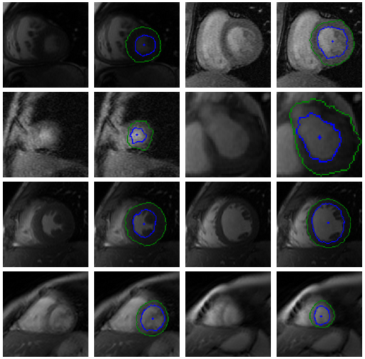
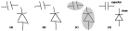
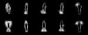
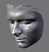

Welcome to my Github pages

### Code

Some opensource code I wrote  

* Pynetkey (Stellenbosch University firewall application)
  * 
  * https://github.com/janto/pynetkey (development site)

* Scikits index
  * [http://scikits.appspot.com/](http://scikits.appspot.com/)
  * [http://bitbucket.org/janto/scikits\_index/](http://bitbucket.org/janto/scikits_index/) (source code)

* Motion Capture from Python
  * [Blog entry](http://janto.blogspot.com/2006/01/motion-capture-in-python.html)

* SciTE & Bicycle Repair Man
  * [Blog entry](http://janto.blogspot.com/2006/02/scite-bicycle-repair-man.html)

* Some more bits at [github.com/janto](https://github.com/janto)

### Academic Articles

Interests  
* Conditional Random Fields
* Computer vision
* Machine learning interpretability

PhD dissertation
  * Cardiac MRI Segmentation with conditional random fields
  * 
  * [thesis](files/dreijer_cardiac_2013.pdf), [slides](files/dreijer_presentation_2013.pdf)
  * [YouTube video](http://youtu.be/lGMUpP6EEzI)

MScEng thesis ([DOI](http://hdl.handle.net/10019.1/2477)) 2006
  * Interactive recognition of hand-drawn circuit diagrams
  * 
  * [Blog post](http://janto.blogspot.com/2006/12/interactive-recognition-of-hand-drawn.html)
  * [circuit\_sketch.pdf](files/circuit_sketch.pdf) (thesis)
  * [circuit\_sketch\_presentation.pdf](files/circuit_sketch_presentation.pdf) (slides)
  * [YouTube video](http://youtu.be/6kh2DWtAHBQ)

Articles and presentations
  * Binary Pattern Deflectometry for Facet Characterization, SolarPACES 2015 [poster](files/2015-10-12_Poster_SP_2015.pdf)
  * Left ventricular segmentation from MRI datasets with edge modelling conditional random fields [BMC Medical Imaging 2013](http://www.biomedcentral.com/1471-2342/13/24/) (article)
  * CRF segmentation of cardiac MRIs, South African Symposium on Numerical and Applied Mathematics 2012, [slides](files/sanum2012janto.pdf)
  * Edge modelling MRFs for cardiac MRI segmentation, Pattern Recognition Association of South Africa (2010), [prasa2010janto.pdf](files/prasa2010janto.pdf) (article)

* Action Classification using the Average of Pose Changes
  * 
  * Proceedings of the 19th Annual Symposium of the Pattern Recognition Association of South Africa, 2008 [prasa2008janto.pdf](files/prasa2008janto.pdf) (article)

### Commercial Projects

Currently engaged in consulting work.

Previous employment:

* Ambrite
  * ML / anaomaly detection
  * [www.ambrite.ch](https://www.ambrite.ch/)

* Stellenergy / Helio100
  * Heliostat control system and deflectometry
  * [helio100.sun.ac.za](https://helio100.sun.ac.za/)

* CustomMed Orthopaedics
  * 3D surgical planning software
  * [Youtube videos](https://youtube.com/playlist?list=PLqRhh0VwYC3wMBg8r77JY66o5ObuTgwO-)

### Contact Info

* [jantod@gmail.com](mailto:jantod@gmail.com)
* [LinkedIn](http://www.linkedin.com/in/janto)
