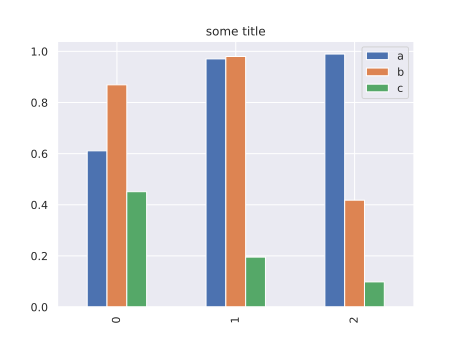

<!-- Copyright Janto Dreijer-->
<!-- [[[cog from cog_tools import *]]] -->
<!-- [[[end]]] -->

# Tests

Here is some code

<!-- [[[cog
exec_python_block_and_output(''' -->
```python
print(1+191+2)
```
<!-- ''', globals(), locals(), inter="output:")
]]] -->
output:
<!-- START print_block() output -->
```python
194
```
<!-- STOP print_block() output -->
<!-- [[[end]]] -->

Which is nice

<!-- [[[cog

docs_directory = Path("test")
data_directory = docs_directory / Path("data")
img_gen_directory = docs_directory / Path("images/generated")

def do_stuff(data_filename, title):

    # load data
    data_filename = Path(data_filename)
    df = pd.read_json(data_filename.open())
    #del df["bla"]

    # write table
    table_md = df.to_markdown(index=False, floatfmt='.3f')
    table_md = table_md.replace(" nan ", " ") # hack
    comment(f"from {data_filename}")
    cog.outl(table_md)

    # create image
    plot_type = "barchart"
    fig = df.plot.bar()
    pylab.title(title)

    filename = img_gen_directory / Path(f"{data_filename.stem}_{plot_type}.svg")
    filename.parent.mkdir(parents=True, exist_ok=True)

    pylab.savefig(filename)
    pylab.close('all')

    comment(f"from {data_filename}")
    cog.outl(f'''<p align="center"></p>''')

comment("hello")

print_block(4+4)

# generate data
df = pd.DataFrame(np.random.random((3,3)), columns=list("abc"))


cog.outl("just print")
print_block(df)

# save data
data_filename = data_directory / Path("some_data.json")
data_filename.parent.mkdir(parents=True, exist_ok=True)
with data_filename.open("w") as f:
    df.to_json(f, indent=2)

cog.outl(f"some things from `{data_filename}`")
do_stuff(data_filename, "some title")


]]] -->
<!-- hello -->
<!-- START print_block() output -->
```python
8
```
<!-- STOP print_block() output -->
just print
<!-- START print_block() output -->
```python
          a         b         c
0  0.611082  0.869200  0.451189
1  0.970479  0.980046  0.195239
2  0.989514  0.417930  0.098282
```
<!-- STOP print_block() output -->
some things from `test/data/some_data.json`
<!-- from test/data/some_data.json -->
|     a |     b |     c |
|------:|------:|------:|
| 0.611 | 0.869 | 0.451 |
| 0.970 | 0.980 | 0.195 |
| 0.990 | 0.418 | 0.098 |
<!-- from test/data/some_data.json -->
<p align="center"></p>
<!-- [[[end]]] -->


